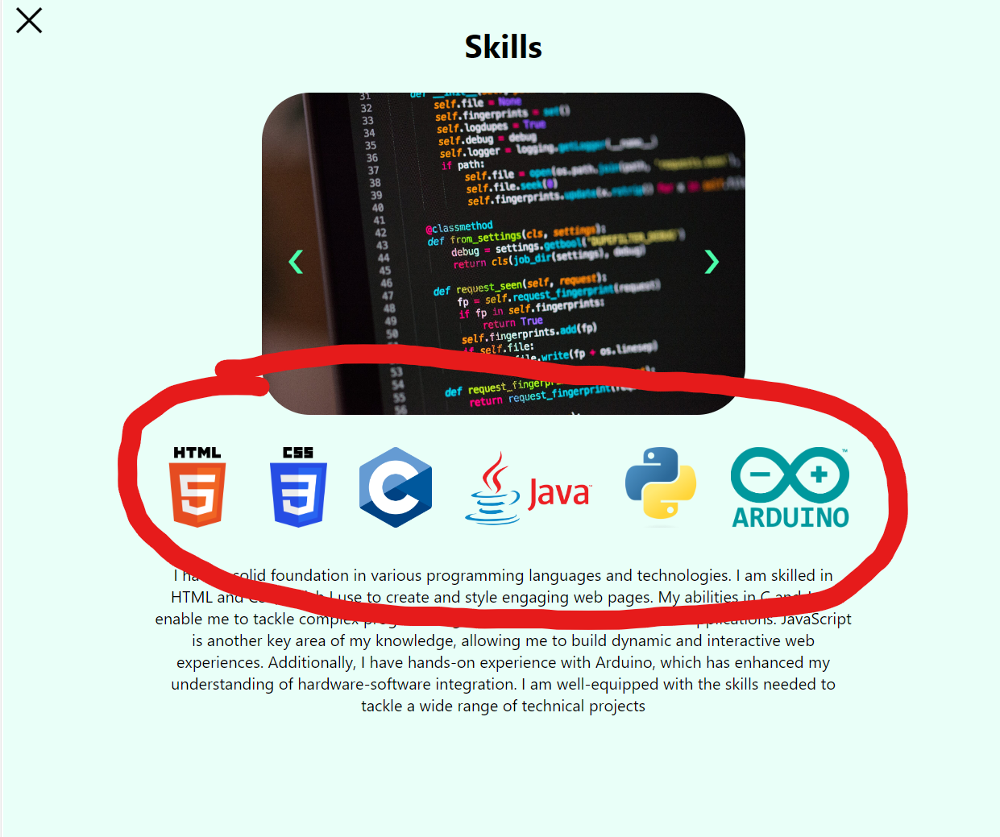

# **MET CS601: Final Term Project**
This is a README.md - summary for Final Term Project.

This webpage is built by React Application. Below is a summary of the project structure and its components.

## Github Page Link
https://jlyun9000.github.io/finalterm-jlyun/

## App.js
Root component of the React Application. It integrates four main pages:
+ Homepage: Main page.
+ Education: Display educational background.
+ Gallery: Display images.
+ KkomiGallery: Display my dog Kkomi's images.
+ Resume: Display My Resume.

## Homepage.js / Homepage.css
functional component that serves as the main landing page of the application. It includes four sub-components:

+ Header.js / Header.css
> Displayed on the top of the webpage. There are tabs which navigate to corresponding page.
+ Welcome.js / Welcome.css
> Displays a welcome message with a background image.
+ Mainpage.js / Mainpage.css
> In the mainpage, there are items displyed as a grid. Some items (Education, Gallery, Kkomi's Gallery) have button link to otehr components: Education, Gallary and KkomiGallry.
+ Footer.js / Footer.css
> Contains quick navigation links, mailto and phone call links, and other links (Resume, Github Link)

## Education.js / Education.css
A component displays my educational background with school logos.

## Gallery.js / Gallery.css
A gallery component displaying my travel photos in a grid layout.

## KkomiGallery.js / KkomiGallery.css
A gallery component displaying my dog Kkomi's phots in a grid layout.

## Other files
### Abilities.js
This component displays images of programming languages I can do.

### json files ( datas.json / gallery.json, / kkomi.json)

> datas.json is used in Mainpage.js, use for displaying each item's description.

> gallery.json and kkomi.json is use for minimizing Gallery.js/KkomiGallery.js code.

## Screenshots
### Header and Welcome Image 

### Mainpage Image 

> If you click item, you can see this kind of page
>
>
>
>You can see buttons when you click certain items

### Footer Image

Phone call connects to fictional phone number.

### Education Image

### Gallery Image

### KkomiGallery Image

Images on each Gallery and KkomiGallery be enlarged when clicked.

